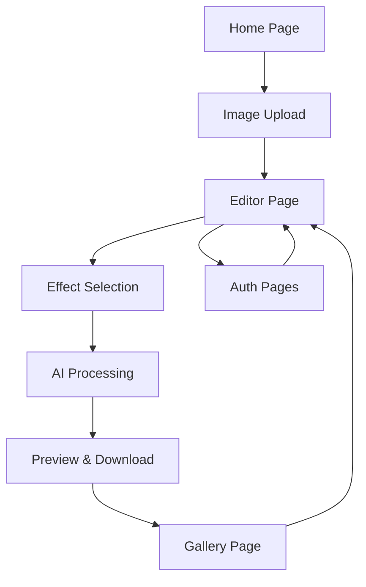

# AI Photo Effects Studio - Product Requirements Document

## 1. Product Overview
AI Photo Effects Studio is a web-based photo editing platform that allows users to upload images and apply AI-powered preset effects using Google's Gemini 2.5 Flash model. The platform focuses on fun, creative transformations like the "big head effect" and other artistic filters that leverage advanced AI image generation capabilities.

The product targets casual users, social media enthusiasts, and content creators who want to quickly apply unique AI-generated effects to their photos without requiring technical expertise in photo editing.

## 2. Core Features

### 2.1 User Roles
| Role | Registration Method | Core Permissions |
|------|---------------------|------------------|
| Guest User | No registration required | Can upload images and apply basic effects with watermark |
| Registered User | Email registration | Full access to all effects, save/download without watermark, effect history |

### 2.2 Feature Module
Our AI Photo Effects Studio consists of the following main pages:
1. **Home page**: hero section showcasing effect examples, navigation menu, quick upload area, featured effects gallery.
2. **Editor page**: image upload area, effect selection panel, preview canvas, processing status, download controls.
3. **Gallery page**: user's processed images history, sharing options, re-edit functionality.
4. **Auth pages**: login and registration forms with social media integration options.

### 2.3 Page Details
| Page Name | Module Name | Feature description |
|-----------|-------------|---------------------|
| Home page | Hero Section | Display rotating showcase of before/after effect examples with smooth transitions |
| Home page | Quick Upload | Drag-and-drop image upload area with file format validation (JPEG, PNG, WebP) |
| Home page | Effects Gallery | Grid display of available AI effects with preview thumbnails and descriptions |
| Home page | Navigation | Header with logo, menu items, user account access, and call-to-action buttons |
| Editor page | Image Upload | Advanced upload interface with crop/resize options and image quality optimization |
| Editor page | Effects Panel | Categorized list of AI effects (Face Effects, Artistic Filters, Style Transfer) with intensity controls |
| Editor page | Preview Canvas | Real-time preview area showing original and processed images side-by-side |
| Editor page | Processing Status | Progress indicator with estimated completion time and processing queue position |
| Editor page | Download Controls | Export options with different resolutions, formats, and quality settings |
| Gallery page | Image History | Grid view of user's processed images with metadata (date, effect used, original filename) |
| Gallery page | Sharing Options | Direct social media sharing, link generation, and embed code creation |
| Gallery page | Re-edit Function | Quick access to re-apply different effects to previously uploaded images |
| Auth pages | Login Form | Email/password authentication with "Remember Me" and password recovery options |
| Auth pages | Registration Form | Account creation with email verification and optional profile setup |

## 3. Core Process
**Guest/Registered User Flow:**
1. User visits homepage and sees effect examples
2. User uploads an image via drag-and-drop or file browser
3. System validates image format and size, redirects to editor
4. User selects desired AI effect from categorized panel
5. System sends image and effect parameters to Gemini 2.5 Flash API
6. User sees real-time processing status and preview updates
7. Once processing completes, user can download or save to gallery
8. Registered users can access their gallery to view/share previous edits

## 4. User Interface Design
### 4.1 Design Style
- **Primary Colors**: Deep purple (#6366f1) and bright cyan (#06b6d4) for a modern, tech-forward aesthetic
- **Secondary Colors**: Soft gray (#f8fafc) backgrounds with dark charcoal (#1e293b) text
- **Button Style**: Rounded corners (8px radius) with subtle shadows and hover animations
- **Typography**: Inter font family, 16px base size for body text, 24px+ for headings
- **Layout Style**: Card-based design with generous white space, floating panels for tools
- **Icons**: Outline-style icons with 2px stroke width, complemented by playful AI-themed illustrations

### 4.2 Page Design Overview
| Page Name | Module Name | UI Elements |
|-----------|-------------|-------------|
| Home page | Hero Section | Full-width gradient background, large heading with animated text effects, floating before/after image cards |
| Home page | Quick Upload | Dashed border upload zone with drag-over highlighting, file type icons, progress animations |
| Home page | Effects Gallery | 3-column responsive grid, hover effects revealing effect names, subtle shadow on cards |
| Editor page | Image Upload | Split-screen layout, left panel for upload controls, right panel for image preview |
| Editor page | Effects Panel | Collapsible sidebar with categorized tabs, effect thumbnails with loading states |
| Editor page | Preview Canvas | Center-focused canvas with zoom controls, side-by-side comparison slider |
| Editor page | Processing Status | Floating notification with circular progress indicator and estimated time |
| Gallery page | Image History | Masonry-style grid layout, hover overlays showing edit options and metadata |
| Auth pages | Forms | Centered modal-style forms with social login buttons and form validation feedback |

### 4.3 Responsiveness
The platform is designed mobile-first with responsive breakpoints at 768px (tablet) and 1024px (desktop). Touch interactions are optimized for mobile devices, including swipe gestures for effect browsing and pinch-to-zoom for image preview. The editor interface adapts to smaller screens by converting the sidebar to a bottom sheet and simplifying the preview canvas controls.