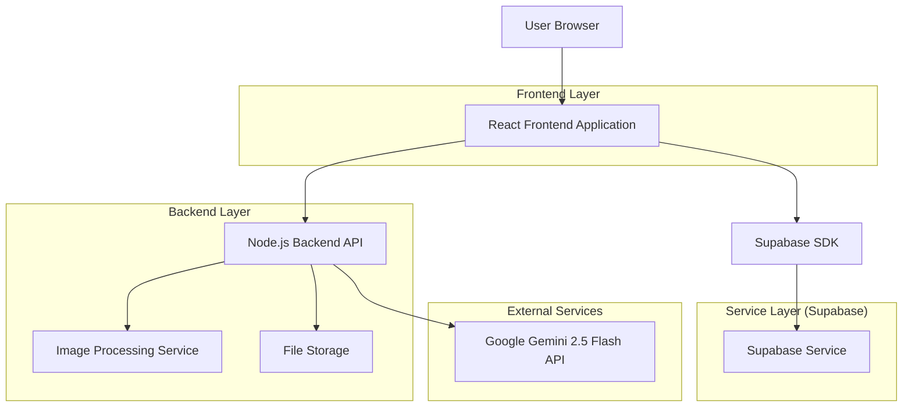
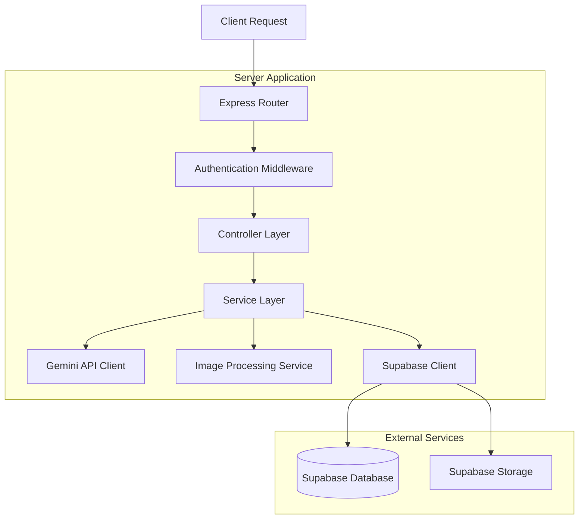
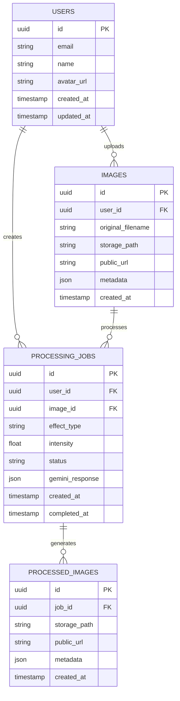

# AI Photo Effects Studio - Technical Architecture Document

## 1. Architecture Design



## 2. Technology Description
- Frontend: React@18 + TypeScript + Tailwind CSS@3 + Vite + React Router
- Backend: Node.js@18 + Express@4 + TypeScript + Multer (file uploads)
- Database: Supabase (PostgreSQL)
- Authentication: Supabase Auth
- File Storage: Supabase Storage
- AI Processing: Google Gemini 2.5 Flash API
- Image Processing: Sharp (Node.js) + Canvas API (Frontend)

## 3. Route Definitions
| Route | Purpose |
|-------|---------|
| / | Home page with hero section and quick upload functionality |
| /editor | Main editing interface with image upload and effect selection |
| /gallery | User's processed images history and management |
| /login | User authentication page |
| /register | User registration page |
| /profile | User profile settings and account management |

## 4. API Definitions

### 4.1 Core API

**Image Upload**
```
POST /api/images/upload
```

Request (multipart/form-data):
| Param Name | Param Type | isRequired | Description |
|------------|------------|------------|-------------|
| image | File | true | Image file (JPEG, PNG, WebP, max 10MB) |
| userId | string | false | User ID for registered users |

Response:
| Param Name | Param Type | Description |
|------------|------------|-------------|
| success | boolean | Upload status |
| imageId | string | Unique identifier for uploaded image |
| imageUrl | string | Temporary URL for image access |
| metadata | object | Image dimensions, format, file size |

Example Response:
```json
{
  "success": true,
  "imageId": "img_abc123",
  "imageUrl": "https://storage.supabase.co/temp/abc123.jpg",
  "metadata": {
    "width": 1920,
    "height": 1080,
    "format": "jpeg",
    "size": 2048576
  }
}
```

**Apply AI Effect**
```
POST /api/effects/apply
```

Request:
| Param Name | Param Type | isRequired | Description |
|------------|------------|------------|-------------|
| imageId | string | true | ID of uploaded image |
| effectType | string | true | Effect name (e.g., "big_head", "artistic_style") |
| intensity | number | false | Effect intensity (0.1-1.0, default 0.8) |
| userId | string | false | User ID for registered users |

Response:
| Param Name | Param Type | Description |
|------------|------------|-------------|
| success | boolean | Processing status |
| jobId | string | Processing job identifier |
| estimatedTime | number | Estimated completion time in seconds |

Example Request:
```json
{
  "imageId": "img_abc123",
  "effectType": "big_head",
  "intensity": 0.9,
  "userId": "user_xyz789"
}
```

**Get Processing Status**
```
GET /api/effects/status/:jobId
```

Response:
| Param Name | Param Type | Description |
|------------|------------|-------------|
| status | string | "processing", "completed", "failed" |
| progress | number | Completion percentage (0-100) |
| resultUrl | string | URL of processed image (when completed) |
| error | string | Error message (when failed) |

**User Gallery**
```
GET /api/gallery/:userId
```

Response:
| Param Name | Param Type | Description |
|------------|------------|-------------|
| images | array | Array of processed image objects |
| totalCount | number | Total number of user's images |
| page | number | Current page number |

## 5. Server Architecture Diagram



## 6. Data Model

### 6.1 Data Model Definition



### 6.2 Data Definition Language

**Users Table**
```sql
-- Create users table (handled by Supabase Auth)
CREATE TABLE public.user_profiles (
    id UUID REFERENCES auth.users(id) PRIMARY KEY,
    email VARCHAR(255) NOT NULL,
    name VARCHAR(100),
    avatar_url TEXT,
    plan VARCHAR(20) DEFAULT 'free' CHECK (plan IN ('free', 'premium')),
    usage_count INTEGER DEFAULT 0,
    created_at TIMESTAMP WITH TIME ZONE DEFAULT NOW(),
    updated_at TIMESTAMP WITH TIME ZONE DEFAULT NOW()
);

-- Enable RLS
ALTER TABLE public.user_profiles ENABLE ROW LEVEL SECURITY;

-- Create policies
CREATE POLICY "Users can view own profile" ON public.user_profiles
    FOR SELECT USING (auth.uid() = id);

CREATE POLICY "Users can update own profile" ON public.user_profiles
    FOR UPDATE USING (auth.uid() = id);

-- Grant permissions
GRANT SELECT ON public.user_profiles TO anon;
GRANT ALL PRIVILEGES ON public.user_profiles TO authenticated;
```

**Images Table**
```sql
CREATE TABLE public.images (
    id UUID PRIMARY KEY DEFAULT gen_random_uuid(),
    user_id UUID REFERENCES public.user_profiles(id),
    original_filename VARCHAR(255) NOT NULL,
    storage_path TEXT NOT NULL,
    public_url TEXT NOT NULL,
    metadata JSONB DEFAULT '{}',
    created_at TIMESTAMP WITH TIME ZONE DEFAULT NOW()
);

-- Create indexes
CREATE INDEX idx_images_user_id ON public.images(user_id);
CREATE INDEX idx_images_created_at ON public.images(created_at DESC);

-- Enable RLS
ALTER TABLE public.images ENABLE ROW LEVEL SECURITY;

-- Create policies
CREATE POLICY "Users can view own images" ON public.images
    FOR SELECT USING (auth.uid() = user_id OR user_id IS NULL);

CREATE POLICY "Users can insert own images" ON public.images
    FOR INSERT WITH CHECK (auth.uid() = user_id OR user_id IS NULL);

-- Grant permissions
GRANT SELECT ON public.images TO anon;
GRANT ALL PRIVILEGES ON public.images TO authenticated;
```

**Processing Jobs Table**
```sql
CREATE TABLE public.processing_jobs (
    id UUID PRIMARY KEY DEFAULT gen_random_uuid(),
    user_id UUID REFERENCES public.user_profiles(id),
    image_id UUID REFERENCES public.images(id) NOT NULL,
    effect_type VARCHAR(50) NOT NULL,
    intensity FLOAT DEFAULT 0.8 CHECK (intensity >= 0.1 AND intensity <= 1.0),
    status VARCHAR(20) DEFAULT 'pending' CHECK (status IN ('pending', 'processing', 'completed', 'failed')),
    gemini_response JSONB,
    error_message TEXT,
    created_at TIMESTAMP WITH TIME ZONE DEFAULT NOW(),
    completed_at TIMESTAMP WITH TIME ZONE
);

-- Create indexes
CREATE INDEX idx_processing_jobs_user_id ON public.processing_jobs(user_id);
CREATE INDEX idx_processing_jobs_status ON public.processing_jobs(status);
CREATE INDEX idx_processing_jobs_created_at ON public.processing_jobs(created_at DESC);

-- Enable RLS
ALTER TABLE public.processing_jobs ENABLE ROW LEVEL SECURITY;

-- Create policies
CREATE POLICY "Users can view own jobs" ON public.processing_jobs
    FOR SELECT USING (auth.uid() = user_id OR user_id IS NULL);

CREATE POLICY "Users can create jobs" ON public.processing_jobs
    FOR INSERT WITH CHECK (auth.uid() = user_id OR user_id IS NULL);

-- Grant permissions
GRANT SELECT ON public.processing_jobs TO anon;
GRANT ALL PRIVILEGES ON public.processing_jobs TO authenticated;
```

**Processed Images Table**
```sql
CREATE TABLE public.processed_images (
    id UUID PRIMARY KEY DEFAULT gen_random_uuid(),
    job_id UUID REFERENCES public.processing_jobs(id) NOT NULL,
    storage_path TEXT NOT NULL,
    public_url TEXT NOT NULL,
    metadata JSONB DEFAULT '{}',
    created_at TIMESTAMP WITH TIME ZONE DEFAULT NOW()
);

-- Create indexes
CREATE INDEX idx_processed_images_job_id ON public.processed_images(job_id);
CREATE INDEX idx_processed_images_created_at ON public.processed_images(created_at DESC);

-- Enable RLS
ALTER TABLE public.processed_images ENABLE ROW LEVEL SECURITY;

-- Create policies
CREATE POLICY "Users can view processed images" ON public.processed_images
    FOR SELECT USING (
        EXISTS (
            SELECT 1 FROM public.processing_jobs pj 
            WHERE pj.id = job_id 
            AND (pj.user_id = auth.uid() OR pj.user_id IS NULL)
        )
    );

-- Grant permissions
GRANT SELECT ON public.processed_images TO anon;
GRANT ALL PRIVILEGES ON public.processed_images TO authenticated;
```