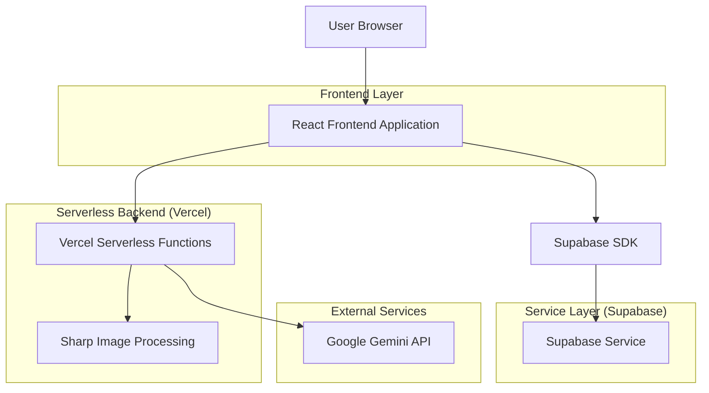
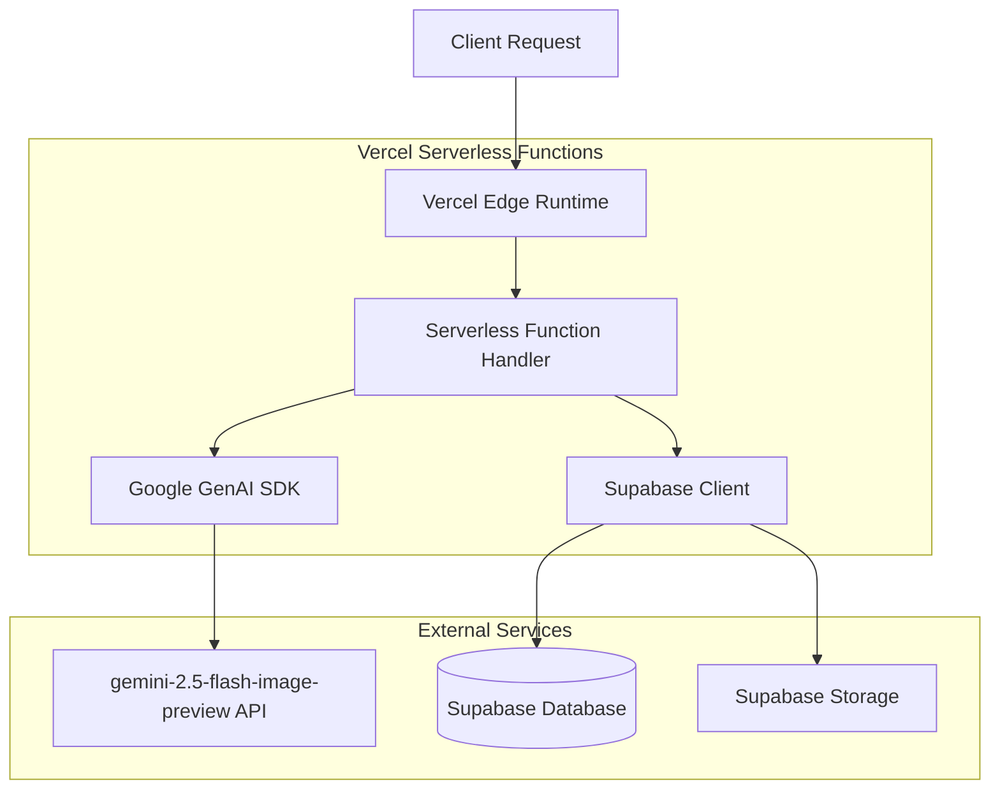
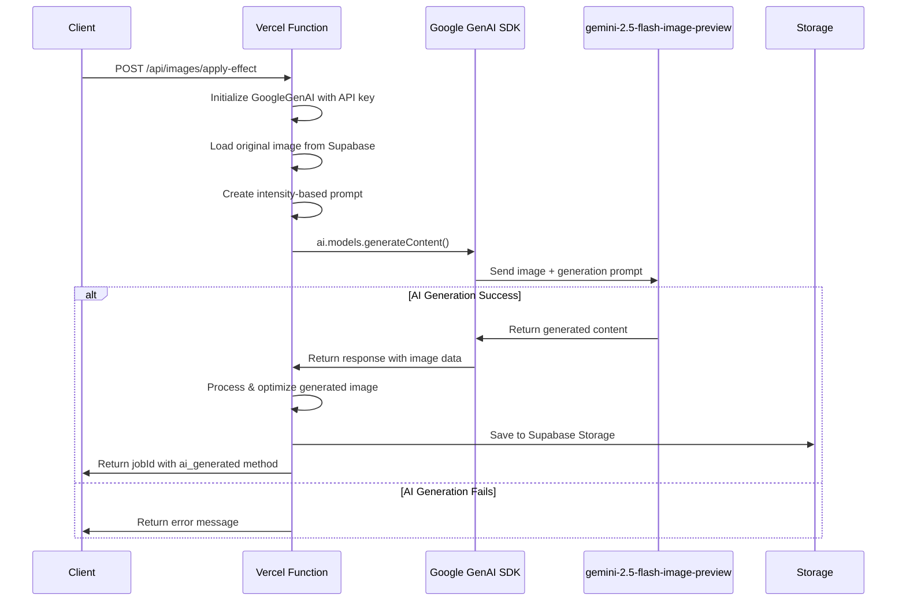
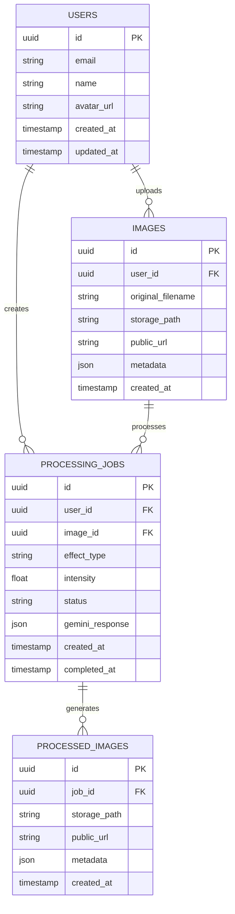

# AI Photo Effects Studio - Technical Architecture Document

## 1. Architecture Design



## 2. Technology Description

* Frontend: React\@18 + TypeScript + Tailwind CSS\@3 + Vite + React Router

* Backend: Vercel Serverless Functions (Node.js runtime)

* Database: Supabase (PostgreSQL)

* Authentication: Supabase Auth

* File Storage: Supabase Storage

* AI Image Generation: Google GenAI SDK (@google/genai) with gemini-2.5-flash-image-preview

* Image Processing: gemini-2.5-flash-image-preview AI generation (all effects handled by AI)

* Deployment: Vercel (Frontend + Serverless Functions)

* Environment Variables: Vercel Environment Variables (secure API key storage)

## 3. Route Definitions

| Route     | Purpose                                                       |
| --------- | ------------------------------------------------------------- |
| /         | Home page with hero section and quick upload functionality    |
| /editor   | Main editing interface with image upload and effect selection |
| /gallery  | User's processed images history and management                |
| /login    | User authentication page                                      |
| /register | User registration page                                        |
| /profile  | User profile settings and account management                  |

## 4. API Definitions

### 4.1 Core API

**Image Upload**

```
POST /api/images/upload
```

*Vercel Serverless Function:* *`/api/images/upload.ts`*

Request (multipart/form-data):

| Param Name | Param Type | isRequired | Description                            |
| ---------- | ---------- | ---------- | -------------------------------------- |
| image      | File       | true       | Image file (JPEG, PNG, WebP, max 10MB) |
| userId     | string     | false      | User ID for registered users           |

Response:

| Param Name | Param Type | Description                          |
| ---------- | ---------- | ------------------------------------ |
| success    | boolean    | Upload status                        |
| imageId    | string     | Unique identifier for uploaded image |
| imageUrl   | string     | Temporary URL for image access       |
| metadata   | object     | Image dimensions, format, file size  |

Example Response:

```json
{
  "success": true,
  "imageId": "img_abc123",
  "imageUrl": "https://storage.supabase.co/temp/abc123.jpg",
  "metadata": {
    "width": 1920,
    "height": 1080,
    "format": "jpeg",
    "size": 2048576
  }
}
```

**Apply AI Image Generation Effect**

```
POST /api/images/apply-effect
```

*Vercel Serverless Function:* *`/api/images/apply-effect.ts`*

Request:

| Param Name | Param Type | isRequired | Description                                                 |
| ---------- | ---------- | ---------- | ----------------------------------------------------------- |
| imageId    | string     | true       | ID of uploaded image                                        |
| effectType | string     | true       | Effect name (e.g., "big\_head", "artistic\_style", "aging") |
| intensity  | number     | false      | Effect intensity (0.1-1.0, default 0.8)                     |
| userId     | string     | false      | User ID for registered users                                |

Response:

| Param Name    | Param Type | Description                          |
| ------------- | ---------- | ------------------------------------ |
| success       | boolean    | Processing status                    |
| jobId         | string     | Processing job identifier            |
| estimatedTime | number     | Estimated completion time in seconds |
| method        | string     | "ai\_generated" (all effects use AI) |

Example Request:

```json
{
  "imageId": "img_abc123",
  "effectType": "big_head",
  "intensity": 0.9,
  "userId": "user_xyz789"
}
```

**Get Processing Status**

```
GET /api/images/status/[jobId]
```

*Vercel Serverless Function:* *`/api/images/status/[jobId].ts`*

Response:

| Param Name | Param Type | Description                             |
| ---------- | ---------- | --------------------------------------- |
| status     | string     | "processing", "completed", "failed"     |
| progress   | number     | Completion percentage (0-100)           |
| resultUrl  | string     | URL of processed image (when completed) |
| error      | string     | Error message (when failed)             |

**User Gallery**

```
GET /api/images/gallery/[userId]
```

*Vercel Serverless Function:* *`/api/images/gallery/[userId].ts`*

Response:

| Param Name | Param Type | Description                      |
| ---------- | ---------- | -------------------------------- |
| images     | array      | Array of processed image objects |
| totalCount | number     | Total number of user's images    |
| page       | number     | Current page number              |

## 5. Serverless Architecture Diagram



## 6. AI Image Generation Workflow

### 6.1 Primary Workflow (Google GenAI SDK with gemini-2.5-flash-image-preview)



### 6.2 Effect Types and Prompts

| Effect Type     | AI Generation Prompt                                                                                                                                                                                       |
| --------------- | ---------------------------------------------------------------------------------------------------------------------------------------------------------------------------------------------------------- |
| big\_head       | "Transform this image to create a comical big head effect where the person's head is dramatically enlarged while keeping facial features recognizable and maintaining a fun, cartoonish appearance"        |
| artistic\_style | "Transform this image to create a comical big body effect where the person's body proportions are exaggerated in a fun, cartoonish way while keeping the face normal and maintaining a playful appearance" |
| aging           | "Using the provided image of this person, make this person look older with natural aging effects"                                                                                                          |

### 6.3 Logging and Monitoring

The system includes comprehensive logging for:

* Job ID and effect parameters

* Image metadata (size, format, MIME type)

* API call timing and duration

* Response analysis (image data vs text response)

* AI generation success/failure status

* Processing method: AI-generated only

### 6.4 Technical Implementation Details

**Google GenAI SDK Integration:**

* SDK: `@google/genai` (official Google SDK)

* Model: `gemini-2.0-flash-001`

* Input: Image file + text prompt via `generateContent()`

* Output: Generated content with image data or text response

* Security: API key stored in Vercel environment variables

* Error Handling: Graceful failure with user-friendly error messages

**Serverless Function Implementation:**

```typescript
import { GoogleGenAI } from '@google/genai';

// Initialize with secure API key from environment
const genAI = new GoogleGenAI({
  apiKey: process.env.GEMINI_API_KEY
});

// Generate content with image and prompt
const response = await genAI.models.generateContent({
  model: 'gemini-2.0-flash-001',
  contents: [{
    role: 'user',
    parts: [
      { text: prompt },
      { inlineData: { mimeType: 'image/jpeg', data: base64Image } }
    ]
  }]
});

// Check for generated image in response
if (response.candidates?.[0]?.content?.parts) {
  for (const part of response.candidates[0].content.parts) {
    if (part.inlineData?.data) {
      // Process AI-generated image
      generatedImageBuffer = Buffer.from(part.inlineData.data, 'base64');
      break;
    }
  }
} else {
  // Handle AI generation failure
  throw new Error('AI generation failed - no image data returned');
}
```

**Vercel Deployment Configuration:**

* Functions timeout: 60 seconds (configurable in `vercel.json`)

* Runtime: Node.js 18.x

* Environment variables: `GEMINI_API_KEY`, `SUPABASE_URL`, `SUPABASE_ANON_KEY`

* File upload limits: 10MB (Vercel serverless function limit)

**Intensity Mapping:**

* 0.1-0.5: "subtle but visible"

* 0.5-0.8: "moderate but noticeable"

* 0.8-1.0: "very dramatic and exaggerated"

### 6.5 Serverless Deployment Strategy

**Vercel Configuration (`vercel.json`):**

```json
{
  "functions": {
    "api/images/apply-effect.ts": {
      "maxDuration": 60
    },
    "api/images/upload.ts": {
      "maxDuration": 30
    }
  },
  "env": {
    "GEMINI_API_KEY": "@gemini-api-key",
    "SUPABASE_URL": "@supabase-url",
    "SUPABASE_ANON_KEY": "@supabase-anon-key"
  }
}
```

**Environment Variables Setup:**

1. **Development**: Create `.env.local` file:

   ```
   GEMINI_API_KEY=your_gemini_api_key_here
   SUPABASE_URL=your_supabase_project_url
   SUPABASE_ANON_KEY=your_supabase_anon_key
   ```

2. **Production**: Set via Vercel Dashboard or CLI:

   ```bash
   vercel env add GEMINI_API_KEY
   vercel env add SUPABASE_URL
   vercel env add SUPABASE_ANON_KEY
   ```

**Frontend Configuration:**

* Remove Vite proxy configuration (no local server needed)

* API calls directly to `/api/*` routes (handled by Vercel)

* Build command: `npm run build`

* Output directory: `dist`

**Deployment Benefits:**

* **Scalability**: Automatic scaling based on demand

* **Cost-effective**: Pay-per-execution model

* **Security**: API keys secured in Vercel environment

* **Performance**: Edge deployment for global distribution

* **Maintenance**: No server infrastructure to manage

## 7. Data Model

### 7.1 Data Model Definition



### 7.2 Data Definition Language

**Users Table**

```sql
-- Create users table (handled by Supabase Auth)
CREATE TABLE public.user_profiles (
    id UUID REFERENCES auth.users(id) PRIMARY KEY,
    email VARCHAR(255) NOT NULL,
    name VARCHAR(100),
    avatar_url TEXT,
    plan VARCHAR(20) DEFAULT 'free' CHECK (plan IN ('free', 'premium')),
    usage_count INTEGER DEFAULT 0,
    created_at TIMESTAMP WITH TIME ZONE DEFAULT NOW(),
    updated_at TIMESTAMP WITH TIME ZONE DEFAULT NOW()
);

-- Enable RLS
ALTER TABLE public.user_profiles ENABLE ROW LEVEL SECURITY;

-- Create policies
CREATE POLICY "Users can view own profile" ON public.user_profiles
    FOR SELECT USING (auth.uid() = id);

CREATE POLICY "Users can update own profile" ON public.user_profiles
    FOR UPDATE USING (auth.uid() = id);

-- Grant permissions
GRANT SELECT ON public.user_profiles TO anon;
GRANT ALL PRIVILEGES ON public.user_profiles TO authenticated;
```

**Images Table**

```sql
CREATE TABLE public.images (
    id UUID PRIMARY KEY DEFAULT gen_random_uuid(),
    user_id UUID REFERENCES public.user_profiles(id),
    original_filename VARCHAR(255) NOT NULL,
    storage_path TEXT NOT NULL,
    public_url TEXT NOT NULL,
    metadata JSONB DEFAULT '{}',
    created_at TIMESTAMP WITH TIME ZONE DEFAULT NOW()
);

-- Create indexes
CREATE INDEX idx_images_user_id ON public.images(user_id);
CREATE INDEX idx_images_created_at ON public.images(created_at DESC);

-- Enable RLS
ALTER TABLE public.images ENABLE ROW LEVEL SECURITY;

-- Create policies
CREATE POLICY "Users can view own images" ON public.images
    FOR SELECT USING (auth.uid() = user_id OR user_id IS NULL);

CREATE POLICY "Users can insert own images" ON public.images
    FOR INSERT WITH CHECK (auth.uid() = user_id OR user_id IS NULL);

-- Grant permissions
GRANT SELECT ON public.images TO anon;
GRANT ALL PRIVILEGES ON public.images TO authenticated;
```

**Processing Jobs Table**

```sql
CREATE TABLE public.processing_jobs (
    id UUID PRIMARY KEY DEFAULT gen_random_uuid(),
    user_id UUID REFERENCES public.user_profiles(id),
    image_id UUID REFERENCES public.images(id) NOT NULL,
    effect_type VARCHAR(50) NOT NULL,
    intensity FLOAT DEFAULT 0.8 CHECK (intensity >= 0.1 AND intensity <= 1.0),
    status VARCHAR(20) DEFAULT 'pending' CHECK (status IN ('pending', 'processing', 'completed', 'failed')),
    gemini_response JSONB,
    error_message TEXT,
    created_at TIMESTAMP WITH TIME ZONE DEFAULT NOW(),
    completed_at TIMESTAMP WITH TIME ZONE
);

-- Create indexes
CREATE INDEX idx_processing_jobs_user_id ON public.processing_jobs(user_id);
CREATE INDEX idx_processing_jobs_status ON public.processing_jobs(status);
CREATE INDEX idx_processing_jobs_created_at ON public.processing_jobs(created_at DESC);

-- Enable RLS
ALTER TABLE public.processing_jobs ENABLE ROW LEVEL SECURITY;

-- Create policies
CREATE POLICY "Users can view own jobs" ON public.processing_jobs
    FOR SELECT USING (auth.uid() = user_id OR user_id IS NULL);

CREATE POLICY "Users can create jobs" ON public.processing_jobs
    FOR INSERT WITH CHECK (auth.uid() = user_id OR user_id IS NULL);

-- Grant permissions
GRANT SELECT ON public.processing_jobs TO anon;
GRANT ALL PRIVILEGES ON public.processing_jobs TO authenticated;
```

**Processed Images Table**

```sql
CREATE TABLE public.processed_images (
    id UUID PRIMARY KEY DEFAULT gen_random_uuid(),
    job_id UUID REFERENCES public.processing_jobs(id) NOT NULL,
    storage_path TEXT NOT NULL,
    public_url TEXT NOT NULL,
    metadata JSONB DEFAULT '{}',
    created_at TIMESTAMP WITH TIME ZONE DEFAULT NOW()
);

-- Create indexes
CREATE INDEX idx_processed_images_job_id ON public.processed_images(job_id);
CREATE INDEX idx_processed_images_created_at ON public.processed_images(created_at DESC);

-- Enable RLS
ALTER TABLE public.processed_images ENABLE ROW LEVEL SECURITY;

-- Create policies
CREATE POLICY "Users can view processed images" ON public.processed_images
    FOR SELECT USING (
        EXISTS (
            SELECT 1 FROM public.processing_jobs pj 
            WHERE pj.id = job_id 
            AND (pj.user_id = auth.uid() OR pj.user_id IS NULL)
        )
    );

-- Grant permissions
GRANT SELECT ON public.processed_images TO anon;
GRANT ALL PRIVILEGES ON public.processed_images TO authenticated;
```

